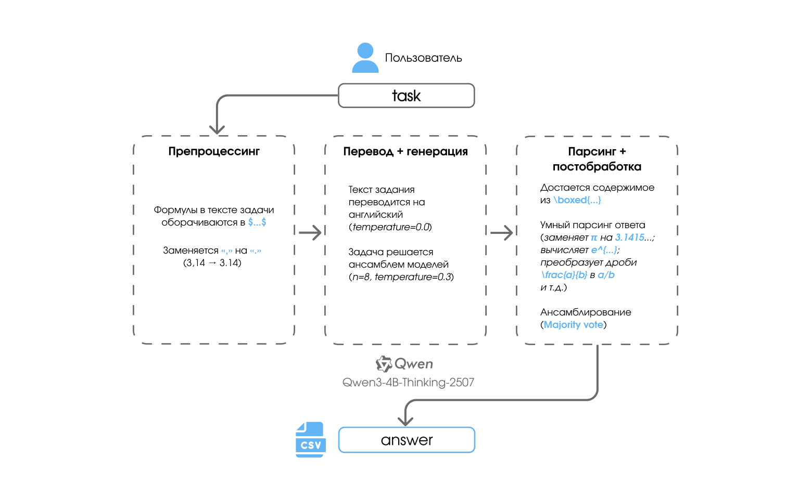
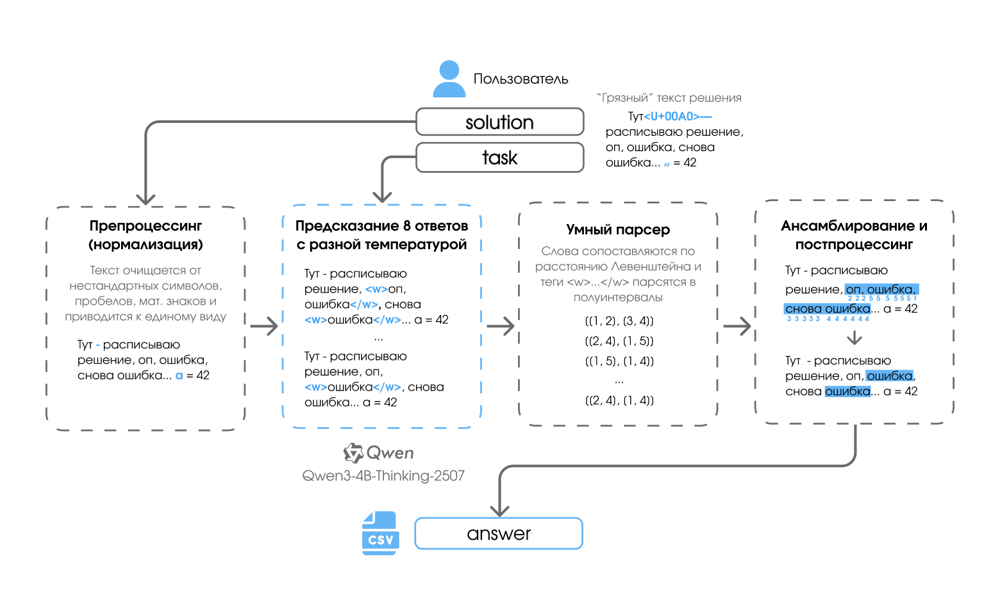
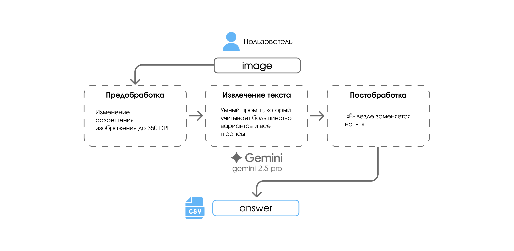

  

<h1 align="center">Мати — AI Challenge&nbsp;2025</h1>

  🥇 <b>Решение 1 места</b>

  Мультимодальный пайплайн для решения задач, поиска ошибок и проверки рукописных решений.

## 📁 Блокноты с решениями

[**Основной этап**](notebooks/01_main_stage_solver.ipynb) — система для решения задач \
[**Полуфинал**](notebooks/02_semifinal_checker.ipynb) — система для проверки решений студентов \
[**Финал**](notebooks/03_final_ocr.ipynb) — OCR система на LLM для считывания текста с изображений

[**Презентация проекта**](presentation.pdf)

## Этапы

  <b>[ Основной этап — решение задач ]</b>

**Ноутбук**: [`01_main_stage_solver.ipynb`](notebooks/01_main_stage_solver.ipynb) \
**Идея**: LLM-пайплайн, который: аккуратно предобрабатывает текст задачи; решает её несколькими прогонами модели и делает ансамблирование; стабилизирует формат ответа (числа, выражения, LaTeX).

  

---

  <b>[ Полуфинал — поиск ошибок в решениях ]</b>

**Ноутбук**: [`02_semifinal_checker.ipynb`](notebooks/02_semifinal_checker.ipynb)  
**Идея**: модель возвращает исходное решение с выделением ошибок, а постобработка: нормализует текст, аккуратно сопоставляет разметку модели с оригиналом и переводит выделения в список полуинтервалов

  

---

  <b>[ Финал — рукописные решения ]</b>

**Ноутбук**: [`03_final_ocr.ipynb`](notebooks/03_final_ocr.ipynb)  
**Идея**: меняем разрешние изображения; VLM-модель распознаёт рукописное решение в текст с формулами; построцессингом заменяем ё на е

  

---

## Команда

Команда `Сидим не рыпаемся`

  

